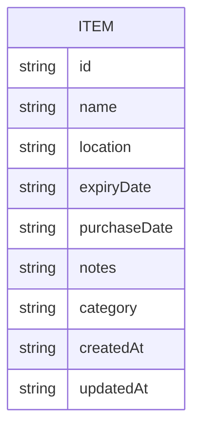

## 1. Architecture Design
```mermaid
graph TB
    A[前端 React 应用] --&gt; B[本地存储 localStorage]
    A --&gt; C[状态管理 Zustand]
    C --&gt; A
```

## 2. Technology Description
- Frontend: React@18 + tailwindcss@3 + vite + TypeScript
- Initialization Tool: vite-init
- Backend: None（使用本地存储）
- Database: localStorage
- 状态管理: Zustand

## 3. Route Definitions
| Route | Purpose |
|-------|---------|
| / | 物品列表页 |
| /add | 添加物品页 |
| /edit/:id | 编辑物品页 |
| /item/:id | 物品详情页 |

## 4. API Definitions
无后端API，使用本地存储

## 5. Server Architecture Diagram
不适用（无后端）

## 6. Data Model

### 6.1 Data Model Definition


### 6.2 Data Definition Language
无SQL数据库，使用localStorage存储JSON数据

### 6.3 TypeScript 类型定义
```typescript
interface Item {
  id: string;
  name: string;
  location: string;
  expiryDate?: string;
  purchaseDate?: string;
  notes?: string;
  category?: string;
  createdAt: string;
  updatedAt: string;
}

type ItemStatus = 'normal' | 'expiring-soon' | 'expired';
```
